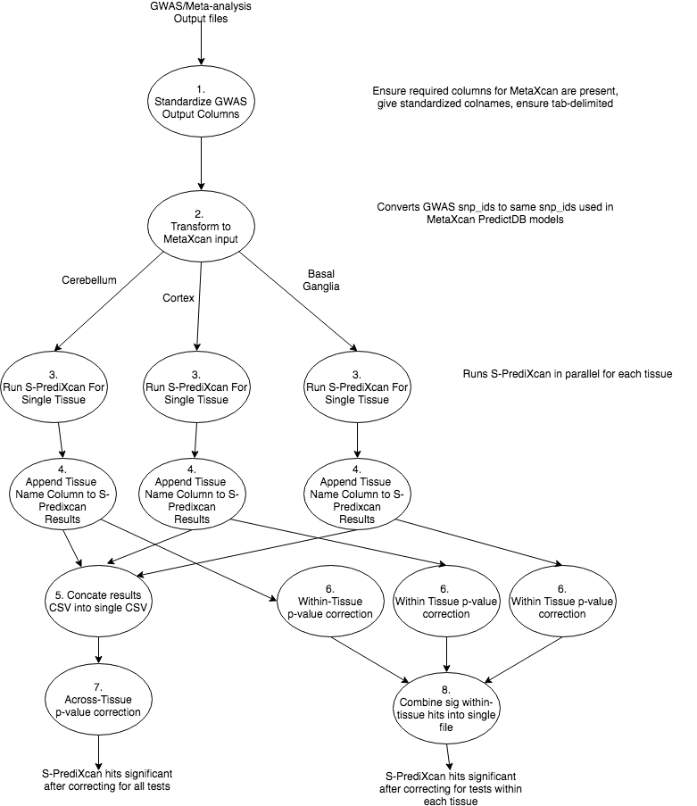
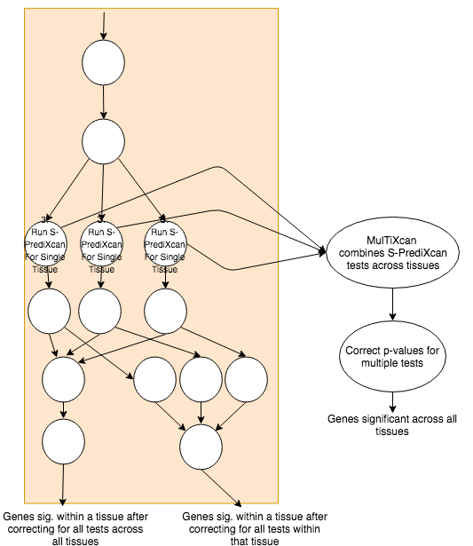

# Metaxcan Pipeline Worklfow 
 Documentation for running [MetaXcan](https://github.com/hakyimlab/MetaXcan/tree/master/software) and [MulTiXcan](https://github.com/hakyimlab/MetaXcan/tree/master/software) on AWS using [WDL+Cromwell](https://software.broadinstitute.org/wdl/)

### Intended audience
This documentation is designed to guide a researcher through the steps necessary to 
run either S-PrediXcan or S-MulTiXcan on their dataset using the AWS cloud computing platform. It is intended more as a users guide than a developers guide.

## Workflow overview
MetaXcan is a suite of tools designed to integrate results from traditional GWAS/Meta-analyses with 
imputed expression data to provide mechanistic evidence for a relationship between genomic variants, 
gene expression patterns, and a phenotype of interest. 
For more information see the [original MetaXcan publication](https://www.nature.com/articles/s41467-018-03621-1) 

This document describes an automated workflow implemented in WDL designed to perform three high-level steps:
    
   1) Transform summary-statistics from GWAS/Meta-analysis into MetaXcan-formatted input
   2) Run MetaXcan's S-PrediXcan to identify relationships between genomic variants, gene expression patterns in specific tissues, and a phenotype
   3) Correct MetaXcan gene p-values for multiple comparisons and filter out significant hits 

Additionally, the S-MulTiXcan workflow goes a step further to identify multi-tissue
associations between gene expression and genomic variants. 

Full documentation of the MetaXcan suite including S-PrediXcan and S-MulTiXcan can be found [here](https://github.com/hakyimlab/MetaXcan/tree/master/software)

### Metaxcan S-PrediXcan workflow overview
<div align=center></div>

### S-MulTiXcan workflow overview
Runs S-PrediXcan workflow but also run S-MultiXcan as a final step to look for genes significant across all tissues. 
<div align=center></div>

### Workflow implementation
The workflows contained in this repo are implemented in the [Workflow Development Language (WDL)](https://software.broadinstitute.org/wdl/). 
As such, all workflows are platform and file-system independent meaning they can be run locally on your own computer,
on major cloud platforms such AWS and GCP, or on an on-prem High-Performance Computing Cluster (HPCC). 
Tools contained in the workflows are fully containerized, meaning a user doesn't need to install any dependencies (e.g. MetaXcan) other than [docker](https://www.docker.com/). 
Additionally, it is intended to be executed using the WDL-specific workflow engine called [Cromwell](https://github.com/broadinstitute/cromwell)

For the purpose of this document, we will focus on how to run the pipeline in the [AWS](https://aws.amazon.com/) environment using Cromwell.  

## Setting up your system
This section describes how to setup your system to execute these workflows.

### Pre-requisites 
   * Unix-based operating system (Linux or OSx. Sorry Windows folks.)
   * Java v1.8 and higher [(download here)](https://www.oracle.com/technetwork/java/javase/downloads/jdk8-downloads-2133151.html)
   * [Docker](https://docs.docker.com/install/)
   * [AWS CLI](https://docs.aws.amazon.com/cli/latest/userguide/cli-chap-install.html)
   
   1. Install [Cromwell](https://cromwell.readthedocs.io/en/stable/tutorials/FiveMinuteIntro/) if you haven't already
   
   2. [Configure the AWS CLI](https://docs.aws.amazon.com/cli/latest/userguide/cli-chap-configure.html) for use with CODE AWS group. 
        * Configure with the secret key associated with the CODE AWS account 
   
   3. Clone local copy of metaxcan-pipeline to download this repository to your local maching
        
        ```
        git clone https://github.com/RTIInternational/metaxcan-pipeline.git    
        ```
   4. Download the [Cromwell AWS config file](https://s3.amazonaws.com/rti-cromwell-output/cromwell-config/cromwell_default_genomics_queue.conf) needed to run the workflow on CODE's AWS DefaultGenomicsQueue. 
        * Keep this handy. It might be best to put the queue file in the repo you download. 
    
        ```bash
        # Change into workflow repo dir
        cd metaxcan-pipeline
  
        # Make var directory (gitignore specifically ignores var folders) 
        mkdir var
  
        # Copy config to var directory 
        cp ~/Downloads/cromwell_default_genomics_queue.conf ./var

        ``` 
   Voila! You're ready to get started running the pipeline.
    
## Running a workflow

### Setting your input parameters

### Run a workflow on AWS via your local machine

### Run a workflow on AWS via CODE's AWS Cromwell-Server

### Checking workflow status

### Workflow outputs

### Helpful hints

## Authors
For any questions, comments, concerns, or bugs,
send me an email or slack and I'll be happy to help. 
* [Alex Waldrop](https://github.com/alexwaldrop) (awaldrop@rti.org)
